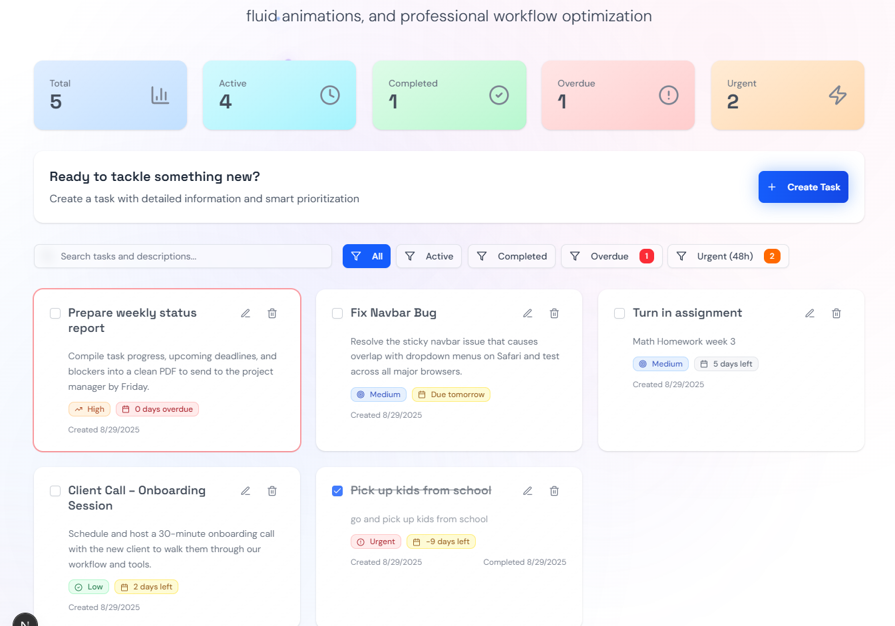

# TaskMaster Pro

A modern, professional task management dashboard that blends **functionality** with **aesthetic excellence**.  
Featuring **glassmorphism design**, **particle animations**, and **intelligent prioritization**, TaskMaster Pro redefines how individuals and teams organize their work.

  

  

---

## ✨ Why TaskMaster Pro?

In today’s fast-paced world, **staying organized isn’t enough**—your tools should also inspire focus, clarity, and creativity.  
TaskMaster Pro combines **professional task management features** with a **cutting-edge UI/UX design**, delivering a solution that is both **practical** and **delightful to use**.

This app was built to **impress clients, managers, and teams** with a level of polish that goes beyond the ordinary “to-do list.”

---

## ⚡ Features at a Glance

### 📝 Smart Task Management
- **Comprehensive Task Creation** — add tasks with detailed titles, descriptions, deadlines, and priority levels  
- **Intelligent Prioritization** — 4 clear priority levels (Low, Medium, High, Urgent) with bold visual indicators  
- **Smart Sorting** — automatically organizes by deadline and priority so urgent work rises to the top  
- **Deadline Tracking** — overdue and urgent tasks are automatically highlighted for immediate attention  

### 🔍 Advanced Filtering & Search
- **Real-time Search** — instantly find tasks by title or description  
- **Priority Filtering** — view only Low, Medium, High, or Urgent tasks  
- **Urgent Task Detection** — tasks due within 48 hours are flagged automatically  
- **Dynamic Counters** — live task counts per category for at-a-glance project health  

### 🎨 Modern User Experience
- **Glassmorphism Design** — elegant frosted-glass panels with subtle transparency and blur effects  
- **Particle Animations** — dynamic floating visuals create a unique, modern atmosphere  
- **Responsive Layout** — built mobile-first, scales seamlessly to desktop workspaces  
- **Smooth Micro-interactions** — hover effects, fades, and fluid transitions make navigation effortless  
- **Professional Branding** — clean typography, balanced spacing, and subtle gradients  

### 📱 Progressive Web App (PWA)
- **Offline Access** — keep working even without internet connectivity  
- **Installable App** — add to your home screen on iOS, Android, or desktop  
- **Optimized Performance** — instant startup and fast interactions  
- **Cross-Platform** — built to perform on all major operating systems and browsers  

### 🔐 Data Management
- **Local Storage First** — tasks are automatically saved in the browser  
- **No Account Needed** — start instantly without registration barriers  
- **Privacy by Design** — all data stays secure on your device  
- **Export Ready** — easily back up or transfer your data when needed  

---

## 🎯 Who Is It For?

- **Professionals & Entrepreneurs** — manage projects, deadlines, and daily workflow  
- **Students** — track assignments, exams, and study plans  
- **Creative Teams** — organize client deliverables without distractions  
- **Agencies & Studios** — present a visually polished solution to impress clients  
- **Anyone** who values **design + productivity** in equal measure  

---

## 🚀 Experience the Demo

Open TaskMaster Pro and discover:  
- Particle animations that bring a sense of energy to productivity  
- Intuitive task creation via a sleek floating action button  
- Real-time filtering and searching for complete control  
- Glassmorphism panels and smooth transitions for a premium feel  
- Fully responsive design across mobile, tablet, and desktop  

  

---

## 🛠️ Tech Stack

- **Next.js 14 (App Router)** — modern React framework for speed & scalability  
- **TypeScript** — type safety for maintainable, professional code  
- **TailwindCSS** — responsive styling with utility-first design  
- **shadcn/ui** — modern UI components, accessible and customizable  
- **Lucide Icons** — lightweight and scalable icons  
- **Local Storage API** — client-side persistence without setup  

---

## 💡 Why It Stands Out

Unlike traditional to-do apps, TaskMaster Pro was designed as a **showcase project for professional clients**.  
It not only **proves development skill** but also highlights the ability to **merge functionality, design, and UX storytelling** into a product clients can actually visualize using in their own workflows.

This isn’t just a task app — it’s a **demo of quality, branding, and craftsmanship**.

---

  

